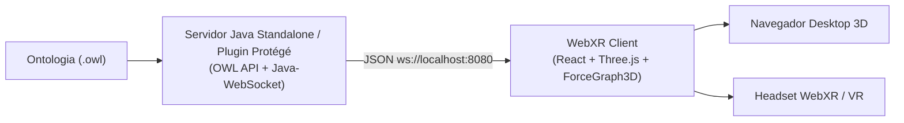

# OntoXR 🌐🕶️

> **Visualização 3D e Imersão WebXR para Ontologias e Grafos de Conhecimento Semânticos.**

OntoXR é uma plataforma aberta que estabelece uma ponte entre a **Web Semântica (IA Simbólica)** e a **Computação Imersiva (Realidade Virtual/Aumentada)**, permitindo navegar por estruturas ontológicas complexas em espaço tridimensional interativo.

---

## 📋 Visão Geral

O **OntoXR** extrai conhecimento estruturado de ontologias em formato OWL (Web Ontology Language) via **OWL API** e plugin **Protégé 5.x** em Java, transmitindo a topologia da ontologia em tempo real via **WebSockets** para uma aplicação web **React + Three.js**. 

A aplicação front-end renderiza um grafo de força 3D em tela cheia com física espacial, mapeamento visual distinto entre Classes e Instâncias/Entidades, painel de detalhes interativo com anotações (`rdfs:comment`) e suporte nativo ao **WebXR (VR)** para headsets como Meta Quest, HTC Vive e Apple Vision Pro.

---

## 🌟 Principais Funcionalidades

- 🌌 **Visualização 3D Imersiva:** Grafo tridimensional interativo baseado em física de força de repulsão e atração.
- 🎨 **Diferenciação Visual Automática:**
  - 🔵 **Classes OWL (`group: class`)**: Renderizadas em esferas azuis (`#3b82f6`).
  - 🟡 **Entidades/Instâncias (`group: individual`)**: Renderizadas em esferas âmbar (`#f59e0b`).
  - 🔗 **Relações Hierárquicas (`subClassOf`) e Instanciação (`instância_de`)**: Arestas direcionadas conectando o grafo.
- 📇 **Painel de Detalhes Interativo:** Clique em qualquer nó para abrir o painel lateral com **Nome**, **Descrição/Anotações (`rdfs:comment`)**, **URI da Ontologia** e indicador de tipo de nó.
- 🥽 **Suporte NATIVO WebXR (VR):** Botão imersivo `"ENTER VR"` ativado automaticamente via Three.js WebXR API para navegação em Realidade Virtual.
- ⚡ **Comunicação Reativa em Tempo Real:** Conexão WebSocket bidirecional para streaming imediato de dados entre o servidor Java e o cliente React.

---

## 🏗️ Arquitetura da Solução



---

## 🛠️ Tecnologias Utilizadas

### **Back-end (Java)**
- **Java 11+**
- **OWL API (4.5.x)**: Extração de classes, indivíduos (`OWLNamedIndividual`), axiomas de subclasse e anotações (`rdfs:comment`, `rdfs:label`).
- **Java-WebSocket**: Servidor WebSocket leve de alta performance.
- **Apache Maven**: Gerenciamento de dependências e build OSGi bundle para Protégé.

### **Front-end (TypeScript / React)**
- **React 18** + **TypeScript** + **Vite**
- **Three.js (r179)**: Motor de renderização WebGL e WebXR.
- **react-force-graph-3d**: Grafo de força 3D declarativo.
- **WebXR API (`VRButton`)**: Integração com dispositivos imersivos de Realidade Virtual.

---

## 🚀 Pré-requisitos & Como Executar

### **1. Pré-requisitos**
- **Node.js** (v18 ou superior) & **npm**
- **Java JDK 11+**
- **Apache Maven** (v3.8+)

---

### **2. Executando o Front-end React (`webxr-client`)**

```bash
# Clone o repositório
git clone https://github.com/lanalcantara/ontoXR.git
cd ontoXR/webxr-client

# Instale as dependências
npm install

# Inicie o servidor de desenvolvimento Vite
npm run dev
```

Acesse o cliente em **[http://localhost:5173](http://localhost:5173)** no seu navegador.

---

### **3. Executando o Servidor WebSocket Java (`plugin-protege`)**

Em um novo terminal na raiz do projeto:

```bash
cd plugin-protege

# Compile o projeto Java
mvn clean package

# Execute o servidor Standalone na porta 8080
mvn exec:java -Dexec.mainClass="br.ufpe.cin.ontoxr.OntoXRStandalone"
```

O console exibirá a confirmação de prontidão:
```text
[OntoXRStandalone] Total de Classes (OWLClass): 33
[OntoXRStandalone] Total de Individuos (OWLNamedIndividual): 28
=== SERVIDOR ONTOXR STANDALONE PRONTO NA PORTA 8080 ===
```

---

## 📁 Estrutura do Repositório

```text
ontoXR/
├── plugin-protege/               # Servidor WebSocket Java & Plugin Protégé 5.x
│   ├── src/main/java/br/ufpe/cin/ontoxr/
│   │   ├── OntoXRServer.java     # Implementação do servidor WebSocket
│   │   ├── OntoXRStandalone.java # Classe executável main standalone
│   │   └── OntoXRViewComponent.java # Componente de visão Protégé OSGi
│   └── pom.xml
├── webxr-client/                 # Cliente Front-end 3D WebXR React
│   ├── src/
│   │   ├── App.tsx               # Componente principal do grafo 3D e painéis UI
│   │   └── main.tsx
│   ├── package.json
│   └── vite.config.ts
└── README.md
```

---

## 📜 Licença

Este projeto está sob a licença **MIT**. Veja o arquivo [LICENSE](LICENSE) para mais detalhes.

---

<p center="align">
  Desenvolvido para exploração avançada de Ontologias e Grafos de Conhecimento em WebXR. 🚀
</p>
