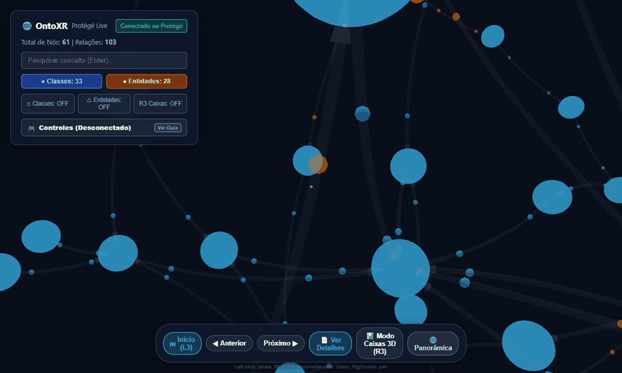
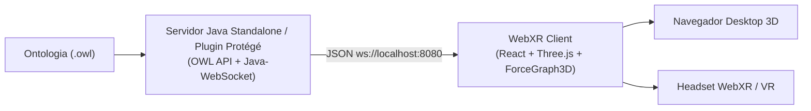

# OntoXR 🌐🕶️

> **Visualização 3D e Imersão WebXR para Ontologias e Grafos de Conhecimento Semânticos.**

<div align="center">
  
  <br/><br/>
  <a href="https://lanalcantara.github.io/ontoXR/">
    
  </a>
  <a href="https://github.com/lanalcantara/ontoXR">
    
  </a>
</div>

**🌐 Acesse a Aplicação Online no GitHub Pages:** **[https://lanalcantara.github.io/ontoXR/](https://lanalcantara.github.io/ontoXR/)**

OntoXR é uma plataforma aberta que estabelece uma ponte entre a **Web Semântica (IA Simbólica)** e a **Computação Imersiva (Realidade Virtual/Aumentada)**, permitindo navegar por estruturas ontológicas complexas em espaço tridimensional interativo.


---

## 📋 Visão Geral

O **OntoXR** extrai conhecimento estruturado de ontologias em formato OWL (Web Ontology Language) via **OWL API** e plugin **Protégé 5.x** em Java, transmitindo a topologia da ontologia em tempo real via **WebSockets** para uma aplicação web **React + Three.js**. 

A aplicação front-end renderiza um grafo de força 3D em tela cheia com física espacial, mapeamento visual distinto entre Classes e Instâncias/Entidades, painel de detalhes interativo com anotações (`rdfs:comment`), suporte a controles/gamepads e suporte nativo ao **WebXR (VR)** para headsets como Meta Quest, HTC Vive e Apple Vision Pro.

---

## 🌟 Principais Funcionalidades

- 🌌 **Visualização 3D Imersiva:** Grafo tridimensional interativo baseado em física de força de repulsão e atração.
- 🎨 **Diferenciação Visual Automática:**
  - 🔵 **Classes OWL (`group: class`)**: Renderizadas em esferas azuis (`#3b82f6`).
  - 🟡 **Entidades/Instâncias (`group: individual`)**: Renderizadas em esferas âmbar (`#f59e0b`).
  - 🔗 **Relações Hierárquicas (`subClassOf`) e Instanciação (`instância_de`)**: Arestas direcionadas conectando o grafo.
- 📦 **Modo Diagrama em Caixas 3D (R3):** Diagramação vertical hierárquica e visualização estruturada com cards 3D texturizados procedurais.
- 🔄 **Navegação Guiada & Cíclica:** Controles de fluxo para percorrer a ontologia sequencialmente (`⏮ Início`, `◀ Anterior`, `Próximo ▶`, `🌐 Panorâmica`).
- 🕹️ **Suporte a Gamepads/Controles:** Reconhecimento automático de controles PlayStation (DualShock/DualSense), Xbox e Nintendo.
- 📇 **Painel de Detalhes Interativo:** Informações completas de nós com **Nome**, **Descrição/Anotações (`rdfs:comment`)**, **URI da Ontologia**, anotações colaborativas e indicador de tipo.
- 🥽 **Suporte NATIVO WebXR (VR):** Botão imersivo `"ENTER VR"` ativado automaticamente via Three.js WebXR API para navegação em Realidade Virtual.
- ⚡ **Comunicação Reativa em Tempo Real:** Conexão WebSocket bidirecional para streaming imediato de dados entre o servidor Java e o cliente React.

---

## 🏗️ Arquitetura da Solução



---

## 🛠️ Tecnologias Utilizadas

### **Back-end (Java)**
- **Java 11+**
- **OWL API (4.5.x)**: Extração de classes, indivíduos (`OWLNamedIndividual`), axiomas de subclasse e anotações (`rdfs:comment`, `rdfs:label`).
- **Java-WebSocket**: Servidor WebSocket leve de alta performance.
- **Apache Maven**: Gerenciamento de dependências e build OSGi bundle para Protégé.

### **Front-end (TypeScript / React)**
- **React 18** + **TypeScript** + **Vite**
- **Three.js (r179)**: Motor de renderização WebGL e WebXR.
- **react-force-graph-3d**: Grafo de força 3D declarativo.
- **WebXR API (`VRButton`)**: Integração com dispositivos imersivos de Realidade Virtual.

---

## 🚀 Pré-requisitos & Como Executar

### **1. Pré-requisitos**
- **Node.js** (v18 ou superior) & **npm**
- **Java JDK 11+**
- **Apache Maven** (v3.8+)

---

### **2. Executando o Projeto**

#### **Opção A: A partir da raiz do repositório (Recomendado)**

```bash
# Iniciar o Front-end React (Vite)
npm run dev

# Em outro terminal, iniciar o Servidor Java Standalone (WebSocket na porta 8080)
npm run server
```

#### **Opção B: Executando individualmente**

```bash
# 1. Front-end React
cd webxr-client
npm install
npm run dev

# 2. Servidor Back-end Java Standalone
cd plugin-protege
mvn compile exec:java -Dexec.mainClass="br.ufpe.cin.ontoxr.OntoXRStandalone"
```

Acesse o cliente em **[http://localhost:5173](http://localhost:5173)** no seu navegador.

---

## 📁 Estrutura do Repositório

```text
ontoXR/
├── docs/                         # Ativos de documentação (GIF demonstrativo)
│   └── demo.gif
├── plugin-protege/               # Servidor WebSocket Java & Plugin Protégé 5.x
│   ├── src/main/java/br/ufpe/cin/ontoxr/
│   │   ├── OntoXRServer.java     # Implementação do servidor WebSocket
│   │   ├── OntoXRStandalone.java # Classe executável main standalone
│   │   ├── OntologyParser.java   # Parser OWL API para JSON
│   │   └── OntoXRViewComponent.java # Componente de visão Protégé OSGi
│   └── pom.xml
├── webxr-client/                 # Cliente Front-end 3D WebXR React
│   ├── src/
│   │   ├── App.tsx               # Grafo 3D, modos de visualização, VR e UI
│   │   └── main.tsx
│   ├── package.json
│   └── vite.config.ts
├── package.json                  # Scripts de atalho na raiz
└── README.md
```

---

## 📜 Licença

Este projeto está sob a licença **MIT**. Veja o arquivo [LICENSE](LICENSE) para mais detalhes.

---

<p align="center">
  Desenvolvido para exploração avançada de Ontologias e Grafos de Conhecimento em WebXR. 🚀
</p>

